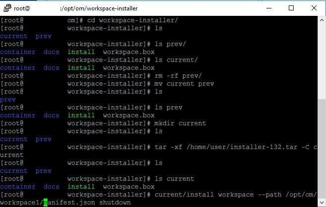
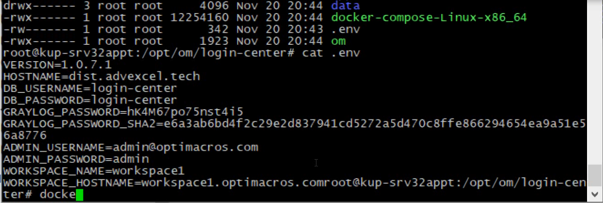

# Изменение параметров установленного Логин-Центра Optimacros:

В случае необходимости изменения адреса Логин Центра для начала следует остановить работу воркспейса. Это можно сделать 
при помощи команды (более подробная информация по остановке воркспейса смотрите [здесь](refresh.md)):

```/opt/om/workspace-installer/current/install workspace --path /opt/om/workspace1/manifest.json shutdown```



Далее нам необходимо изменить данные в .ENV файле для правильной работы nginx, за которым стоит сам Login Center. Для 
этого перейдём в директорию с логин центром с помощью команды:

`cd /opt/om/login-center/`

Затем остановим работу логин центра с помощью команды:

`./om stop`

В директории с Логин центром находится файл .ENV можем посмотреть его содержимое с помощью команды:

`cat .env`



Теперь для изменения данных логин центра нам нужно изменить соответствующие поля, инструкция с обозначениями полей ниже:

```
VERSION - изменять нельзя
HOSTNAME - при смене адреса Login Center
DB_USERNAME - при смене имени пользователя MongoDB
DB_PASSWORD - при смене пароля MongoDB
GRAYLOG_PASSWORD - достаточно для смены пароля администратора http://HOSTNAME/logs
GRAYLOG_PASSWORD_SHA2 - всегда должен соответвовать SHA256 параметра GRAYLOG_PASSWORD
ADMIN_USERNAME - не используется после первого запуска Login Center
ADMIN_PASSWORD - не используется после первого запуска Login Center
WORKSPACE_NAME - не используется после первого запуска Login Center
WORKSPACE_HOSTNAME - при смене адреса воркспейса
```

Чтобы отредактировать файл .ENV воспользуйтесь командой:

`nano ./env`

Затем сохраняем изменения.

Далее в случае смены адреса Логин Центра нам необходимо изменить manifest файл воркспейса, переходим в директорию с файлом манифеста при помощи команды:

`cd /opt/om/worspace1/`

Находясь в этой директории мы можем открыть для редактирования файл манифеста с помощью команды:

`nano manifest.json`

Этот файл выглядит примерно вот так:

```
{
  "container": {
    "ip": "10.0.3.15",
    "cpu": 6,
    "memory": 33685016576,
    "ports": {},
    "hosts": {},
  },
  "workspace": {
    "id": "8522aedecc6b4219ee87ee28",
    "name": "TEST",
    "web": {
      "url": "https://om.test.workspace.ru"
    },
    "loginCenter": {
      "url": "https://lc.company.ru/", // <= Интересующее нас поле в случае смены адреса Логин центра
      "token": "4aed337a0ac34dd13716c476a4c7",
      "apiUrl": "wss://lc.company.ru/api/ws/v1/" // <= Интересующее нас поле в случае смены адреса Логин центра
    },
    "admin": {
      "email": "admin@optimacros.com"
    }
  }
}
```

Нам нужно отредактировать поля Логин Центра, в частности `url` и `apiUrl`
после редактирования файл манифеста будет иметь примерно такой вид: 

```
{
  "container": {
    "ip": "10.0.3.15",
    "cpu": 6,
    "memory": 33685016576,
    "ports": {},
    "hosts": {},
  },
  "workspace": {
    "id": "8522aedecc6b4219ee87ee28",
    "name": "TEST",
    "web": {
      "url": "https://om.test.workspace.ru"
    },
    "loginCenter": {
      "url": "https://новыйАдрес/",
      "token": "4aed337a0ac34dd13716c476a4c7",
      "apiUrl": "wss://новыйАдрес/api/ws/v1/"
    },
    "admin": {
      "email": "admin@optimacros.com"
    }
  }
}
```

После этого нам остаётся вновь запустить Логин центр и возобновить работу воркспейса. Переходим в директорию Логин 
Центра с помощью команды:

`cd /opt/om/login-center/`

Затем запускаем Логин Центр командой:

`./om start`

Затем запускаем работу воркспейса командой:

```/opt/om/workspace-installer/current/install workspace --path /opt/om/workspace1/manifest.json up```


Дожидаемся окончания такого вывода терминала:


И так же в случае смены адреса логин центра, обязательно нужно изменить параметр webroot на странице конфигурации Login Center 
(по адресу http://.../admin/config/urls) для правильных ссылок в отправляемых емейлах о сбросе пароля и приглашении 
новых пользователей.


На этом всё
  
[Вернуться к содержанию <](contents.md)

[Вернуться к оглавлению <<](index.md)