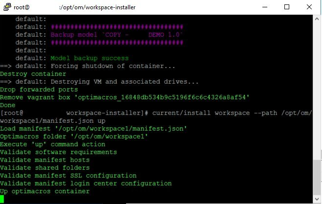

# Изменение адреса/имени Воркспейса:

В случае необходимости изменения адреса Воркспейса, для начала следует остановить работу воркспейса. Это можно сделать 
при помощи команды (более подробная информация по остановке воркспейса смотрите [здесь](refreshWs.md)):

```/om/workspace-installer/current/install workspace --path /om/workspace1/manifest.json shutdown```


Далее нам необходимо изменить данные в .ENV файле для правильной работы nginx, за которым стоит сам Login Center. Для 
этого перейдём в директорию с Логин Центром с помощью команды:

`cd /om/login-center/`

В директории с Логин Центром находится файл .ENV, можем посмотреть его содержимое с помощью команды:

`cat .env`


Теперь для изменения данных Логин Центра, нам нужно изменить соответствующие поля, инструкция с обозначениями полей ниже:

```
VERSION - изменять нельзя
HOSTNAME - при смене адреса Login Center
DB_USERNAME - при смене имени пользователя MongoDB
DB_PASSWORD - при смене пароля MongoDB
GRAYLOG_PASSWORD - достаточно для смены пароля администратора http://HOSTNAME/logs
GRAYLOG_PASSWORD_SHA2 - всегда должен соответвовать SHA256 параметра GRAYLOG_PASSWORD
ADMIN_USERNAME - не используется после первого запуска Login Center
ADMIN_PASSWORD - не используется после первого запуска Login Center
WORKSPACE_NAME - не используется после первого запуска Login Center
WORKSPACE_HOSTNAME - при смене адреса воркспейса
```

Чтобы отредактировать файл .ENV воспользуйтесь командой:

`nano ./env`

Нас интересует переменная WORKSPACE_HOSTNAME, изменяем её значение на новый адрес воркпейса.

!!! Очень важно? что при добавлении любого кирилического домена (оптимакрос.рф) в файл .env его нужно добавлять в  формате 
Punycode. Можно воспользоваться любым из онлайн сервисов, допустим: https://hb.by/punycode-converter.aspx в конечном 
итоге домен будет выглядеть примерно вот так: `еxn--80aphgiecmkd.xn--p1ai`

Следующим этапом, нам понадобится сделать обновление записи в базе mongodb Логин Центра.
К сожалению на данный момент, визуальных инструментов для редактирования данных воркспейса или добавления новых связей с
 воркспейсами в Логин Центре нет. 
 
 ## !!!Предупреждение: Неосторожное обращение с базами данных, может привести к необратимым последствиям!!!
 
 Поэтому при необходимости внести изменения, а они вносятся напрямую в базу данных Логин Центра. Воспользуемся 
 командами:
 
`docker exec -it optimacros_db /bin/bash`

Затем введём команду:

`mongo --port 27017 -u DB_USERNAME -p  --authenticationDatabase 'admin'`

Где DB_USERNAME это имя пользователя базы данных, затем нужно будет ввести пароль к базе данных. После чего вводим 
команду:

`use logincenter`

Вся информация о подключаемых воркспейсах хранится в коллекции workspace, одной связи соответствует один документ.

Для просмотра всех документов коллекции workspace, используйте команду:

```
db.workspace.find({})
```

Формат документа:

```
{
    "_id": сгенерировано базой данных автоматически
    "id": "8522aedecc6b4219ee87ee28", случайное 16-ричное число длиной не менее 24 знаков, используется для проверки подключения воркспейса. !Не путать с полем _id!
    "name": "TEST", используется для навигации в UI Логин Центра и воркспейсов
    "description": "Тестовый воркспейс", описание показывается в UI Логин Центра
    "authenticationRedirectUrl": "https://om.test.workspace.ru/auth?token={userToken}", url воркспейса, путь /auth?token={userToken} всегда постоянный, домен (имя или IP адрес) должен соотв. добавляемому воркспейсу
    "domains": ["om.test.workspace.ru"], домен воркспейса без протокола http:// или https://
    "token": "4aed337a0ac34dd13716c476a4c7" СЕКРЕТНОЕ!!! случайное 16-ричное число длиной не менее 24 знаков, используется для проверки подключения воркспейса. 
}
```

При изменении адреса воркспейса в Логин Центре нужно изменить поля domains, authenticationRedirectUrl и, при необходимости, description в соответствующем документе.
При необходимости добавить новую связь создается новый документ и заполняется по схеме выше.

Пример команды обновления документа:

```
db.workspace.updateOne({"id": "4aed337a0ac34dd13716c476a4c7"}, {$set: {"name": "PROD", "description": "Главный воркспейс", "authenticationRedirectUrl": "https://om.prod.workspace.ru/auth?token={userToken}", "domains": ["om.prod.workspace.ru"]}})
```

После всех манипуляций, с базой вводим:

`exit`


После добавления или изменения связи с воркспейсом необходимо перезапустить Логин Центр. Для этого введём 
последовательно команды:

```
./om stop app
./om start app
```

Далее нам необходимо внести изменения в файл манифеста самого воркспейса. Перейдём в директорию воркспейса, для этого 
вводим команду:

`cd /om/worspace1/`

Находясь в этой директории, мы можем открыть для редактирования файл манифеста с помощью команды:

`nano manifest.json`

Этот файл выглядит примерно вот так:

```
{
  "container": {
    "ip": "10.0.3.15",
    "cpu": 6,
    "memory": 33685016576,
    "ports": {},
    "hosts": {},
  },
  "workspace": {
    "id": "8522aedecc6b4219ee87ee28",
    "name": "TEST",
    "web": {
      "url": "https://om.test.workspace.ru" // <= Интересующее нас поле в случае смены адреса Логин Центра
    },
    "loginCenter": {
      "url": "https://lc.company.ru/",
      "token": "4aed337a0ac34dd13716c476a4c7",
      "apiUrl": "wss://lc.company.ru/api/ws/v1/"
    },
    "admin": {
      "email": "admin@optimacros.com"
    }
  }
}
```

Нам нужно отредактировать одно поле для Workspace, в частности `workspace.web.url`
после редактирования, файл манифеста будет иметь примерно такой вид: 

```
{
  "container": {
    "ip": "10.0.3.15",
    "cpu": 6,
    "memory": 33685016576,
    "ports": {},
    "hosts": {},
  },
  "workspace": {
    "id": "8522aedecc6b4219ee87ee28",
    "name": "PROD",
    "web": {
      "url": "https://om.prod.workspace.ru"
    },
    "loginCenter": {
      "url": "https://lc.company.ru/",
      "token": "4aed337a0ac34dd13716c476a4c7",
      "apiUrl": "wss://lc.company.ru/api/ws/v1/"
    },
    "admin": {
      "email": "admin@optimacros.com"
    }
  }
}
```

!!! Очень важно? что при добавлении любого кирилического домена (оптимакрос.рф) в файл manifest.json, его нужно 
добавлять в  формате Punycode. Можно воспользоваться любым из онлайн сервисов, допустим: 
https://hb.by/punycode-converter.aspx в конечном итоге домен будет выглядеть примерно вот так: 
`еxn--80aphgiecmkd.xn--p1ai`

Затем запускаем работу воркспейса командой:

```/om/workspace-installer/current/install workspace --path /om/workspace1/manifest.json up```



Дожидаемся такого вывода терминала:


### Дополнительная информация:
При добавлении нового воркспейса в админке Логин Центра на странице воркспейса `http://.../admin/workspace/<ID>` 
подтвердить связь кнопкой `Grant Approval`, после чего пользователям можно будет давать к нему доступ. 

ID и токен воркспейса должны быть скопированы в конфигурационный файлы самого воркспейса.

В случае компроментации токена воркспейса его можно отключить кнопкой `Revoke Approval` на странице воркспейса в Логин 
Центре.

Для генерации 16-ричных чисел для значений полей id и token можно использовать онлайн сервисы, например: 
https://onlinehextools.com/generate-random-hex-numbers
  
[Вернуться к содержанию <](contents.md)

[Вернуться к оглавлению <<](index.md)
