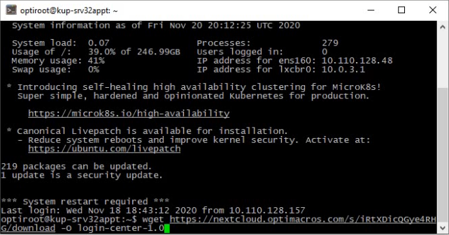
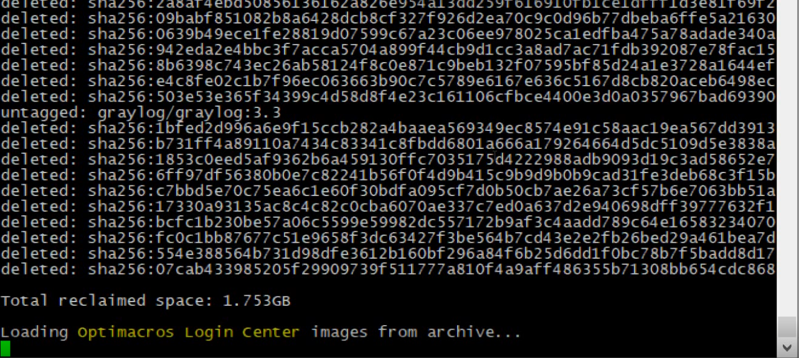
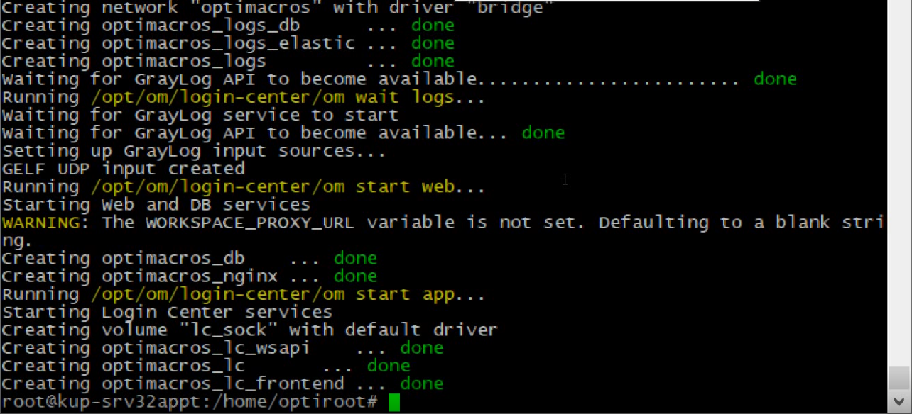

# Чистая установка Логин Центра на клиентский сервер:

Подключаемся к серверу через ssh протокол.

Переходим в аккаунт root с помощью команды `sudo su`


Затем скачиваем дистрибутив Логин Центра через терминал с помощью команды: 

`wget ссылкуНеобходимоЗапроситьУТехническогоОтделаOptimacros/download -O ИМЯ_ФАЙЛА.С_РАСШИРЕНИЕМ`



В случае, если на сервере уже установлен воркспейс, то необходимо завершить его работу. Предварительно открыв файл 
manifest.json, чтобы убедиться, что мы находимся на нужном сервере. Переходим в директории с файлом, как правило, это:
`/om/workspace1` и выполняем команду `cat manifest.json`

После того как мы удостоверились что находимся на нужном сервере (TEST или PROD). Завершаем работу воркспейса.


Далее нам необходимо установить на сервере docker. Устанавливаем его, следуя инструкции из его официального сайта:

https://docs.docker.com/engine/install/ubuntu/

Далее мы создаём директорию на сервере под Логин Центр по пути: `/om/login-center`

Для этого переходим в папку om с помощью команды: `cd /om/` и создаём там директорию login-center с помощью команды
`mkdir login-center`


Теперь когда мы подготовили папку для установки Логин Центра и скачали дистрибутив, нам необходимо будет установить его 
в созданную папку. Для этого переходим в директорию со скачанным ранее дистрибутивом с помощью команды `cd /home/имяПользователя/`. 
Выдаём файлу права с помощью команды `chmod +x login-center-версия.sh` и запускаем инсталлятор с помощью команды 
 `./login-center-версия.sh` во время установки инсталлятор попросит подтвердить установку Логин Центра в дефолтную 
 директорию по пути, которому мы как раз и подготовили директории. Текущая версия инсталлятора устанавливает Логин Центр с
  дефолтными настройками подключения, которые нам предстоит настроить вручную, далее нынешняя версия инсталлятора, выдаёт 
  ошибку со следующим содержимым:
 


Которая нам говорит о том, что по заданным путям отсутствуют файлы сертификатов. Затем мы переходим в директорию, где 
лежит Логин Центр `cd /om/login-center`


Затем мы смотрим содержимое файла .env с помощью команды `cat .env` и видим что там есть только одно свойство VERSION.
 
Посмотрим какие контейнеры нам уже удалось установить, в результате первой попытки установки Логин Центра, воспользуемся командой: 
`docker ps -a`


И посмотреть директорию data `ls -la data`


Видим что Логин Центр прервал установку на самом начальном этапе, до установки базы данных. Теперь мы можем смело 
редактировать .env файл, в соответствии с нашими требованиями. В частности установить пароли к аккаунту админа, пароли к базе 
данных и информацию о web части. 


```
VERSION=1.1.9
HOSTNAME=profile.optimacros.com
DB_USERNAME=login-center
DB_PASSWORD=
ADMIN_USERNAME=admin@optimacros.com
ADMIN_PASSWORD=
WORKSPACE_NAME=workspace1
WORKSPACE_HOSTNAME=workspace1.optimacros.com
```

Более подробное описание полей можно посмотреть тут:
<a href="https://github.com/optimacros/distribution_documentation/blob/main/envDescription.md" target="_blank">ссылка на описание полей .env</a>

Для пароля базы данных (DB_PASSWORD) воспользуемся любым генератором паролей в интернете (http://www.onlinepasswordgenerator.ru/), сгенерировав надёжный пароль длиной более 
20 символов (ОЧЕНЬ важно: пароль не должен содержать символов `@:;/\` это приведёт к багу установки). 

После настройки всех пунктов, сохраняем наши изменения в 
.env файл.

Затем вовращаемся к нашей проблеме во время установки Логин Центра. Переходим в папку с сертификатами с помощью команды
`cd /om/login-center/data/nginx/cert` После чего, находясь в папке для сертификатов, мы генерируем сами сертификаты 
с помощью команды 

`openssl req -newkey rsa:2048 -nodes -keyout crt.key -x509 -days 1095 -out bundle.crt`

Отвечаем на вопросы, которые задаст программа генерации. На этом с генерацией сертификатов мы заканчиваем.

Затем мы переходим снова в папку с инсталлятором Логин Центра с помощью команды: `cd /home/user/` и запускаем инсталлятор 
`./login-center-версия.sh` 

Во время установки на вопрос, нужно ли перезаписывать env файл конечно же отвечаем нет. Ожидаем процесс установки.



Затем увидим вот такую консоль, это значит что Логин Центр успешно установлен.



Можно проверять результат установки в браузере введя имя хоста нашего логин центра.

[Вернуться к содержанию <](contents.md)

[Вернуться к оглавлению <<](index.md)
